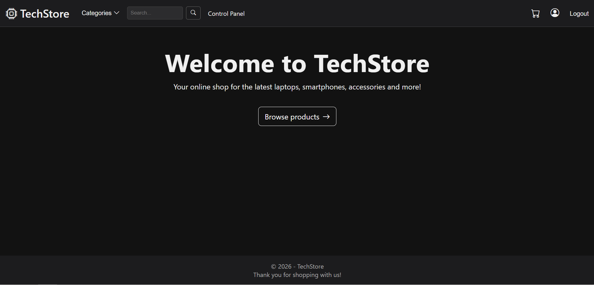
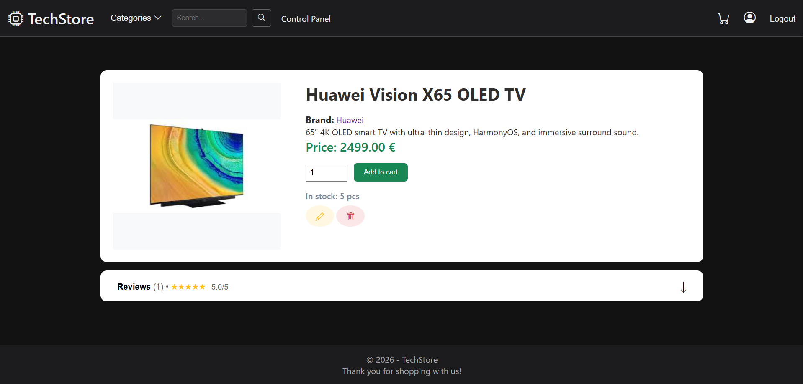
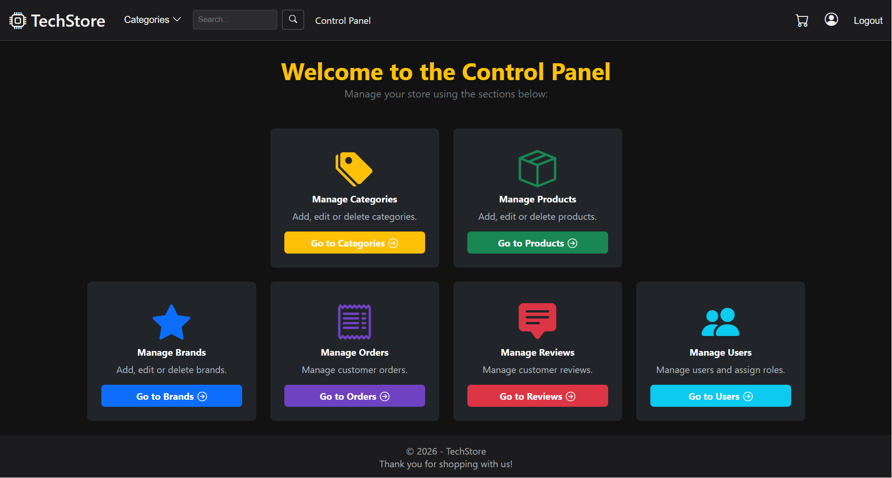

# TechStore

TechStore is a full-stack e-commerce web application built with ASP.NET Core (.NET 8) and Entity Framework Core.

The application provides a complete online shopping experience, including product browsing, cart management, order processing, stripe payments (test mode) and an administrative control panel.

---

### 👤 User Features:
- Browse products by categories
- Search products by name
- Add products to cart
- Place orders
- Leave reviews
- Edit profile information

### 🛠️ Admin & Manager Features:
- Manage products, categories, brands, orders, reviews and users
- Soft delete and restore functionalities

### ⚙️ System Features:
- Pagination
- Role-based authorization
- Cookie-based authentication
- Stripe integration (test mode)

---

## 📸 Screenshots

### Home Page
<p align="left">

</p>

### Product Details
<p align="left">

</p>

### Control Panel
<p align="left">

</p>

---

##  🛠️ Technologies used:

### Backend
- ASP.NET Core (.NET 8)
- Entity Framework Core
- SQL Server

### Frontend
- Razor Views (MVC)
- Bootstrap 5

### Testing
- NUnit
- Moq

---

## 🏗️ Architecture

The application follows a layered architecture:

- Web Layer – Controllers, Views and ViewModels
- Service Layer – Business logic
- Repository Layer – Data access
- Data Layer – Entity Framework Core

Request flow:
Client → Controller → Service → Repository → Database

---

## 🚀 How to run the project

1. Clone the repository:
    ```bash
    git clone https://github.com/MetodiDzhudzhev/TechStore.git
    ```

2. Navigate to the project directory:
    ```bash
    cd TechStore
    ```

3. Restore dependencies:
    ```bash
    dotnet restore
    ```

4. Configure secrets:
    ```bash
    dotnet user-secrets init
    dotnet user-secrets set "ConnectionStrings:DefaultConnection" "..."
    ```

5. Configure Stripe (Optional):
    ```bash
    dotnet user-secrets set "Stripe:PublishableKey" "your_key" 
    dotnet user-secrets set "Stripe:SecretKey" "your_key" 
    dotnet user-secrets set "Stripe:WebhookSecret" "your_webhook_secret"
    ```

6. Enable Stripe (Optional):
    ```bash
    stripe listen --forward-to https://localhost:{localPort}/api/stripe/webhook --skip-verify
    ```

7. Setup Database:
    ```bash
    dotnet ef database update
    ```

8. Run the application:
    ```bash
    dotnet run
    ```

9. Open your browser and navigate to:
    ```bash
    https://localhost:{localPort}/
    ```

---

## 📄 License

This project is licensed under the MIT License.